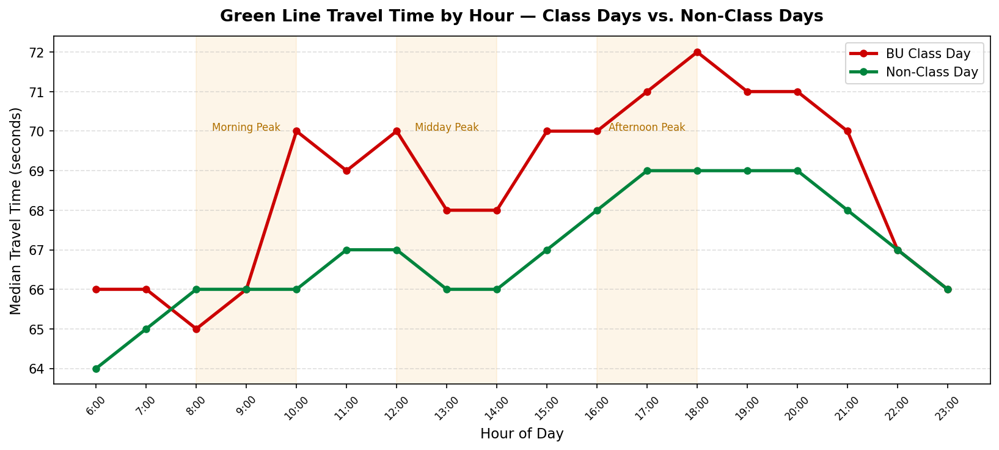
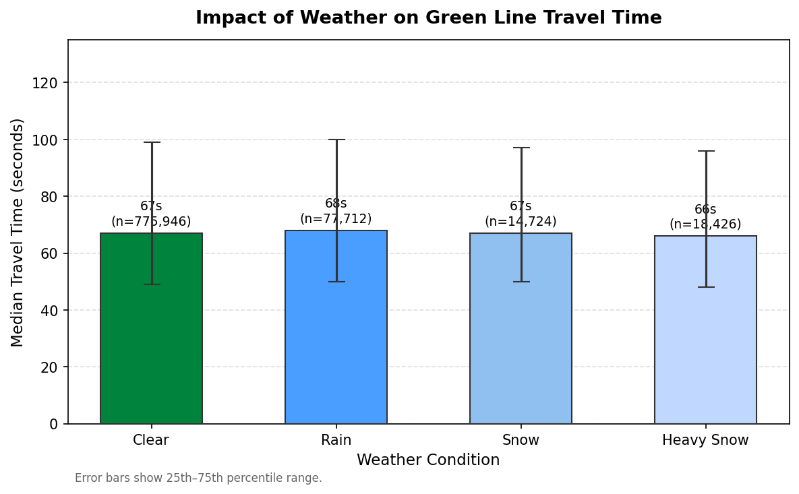
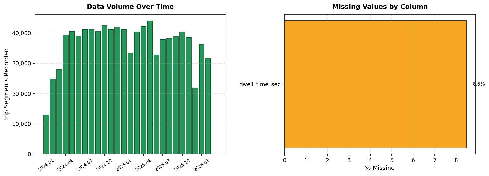
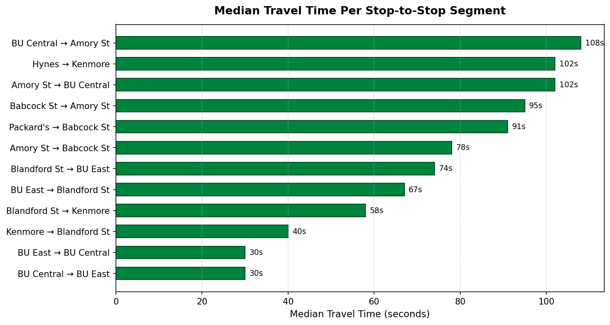
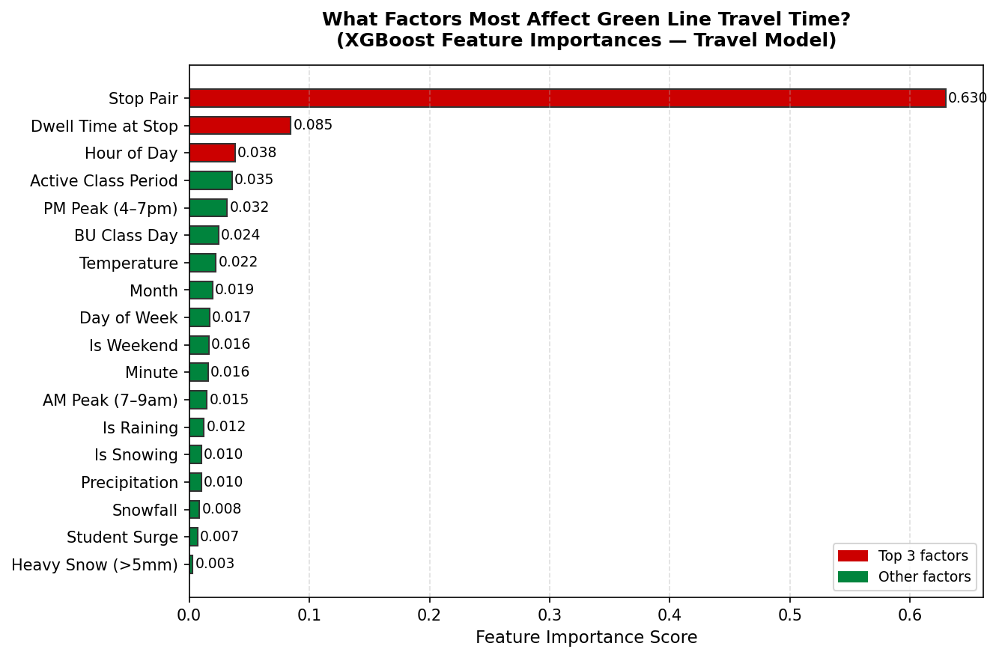
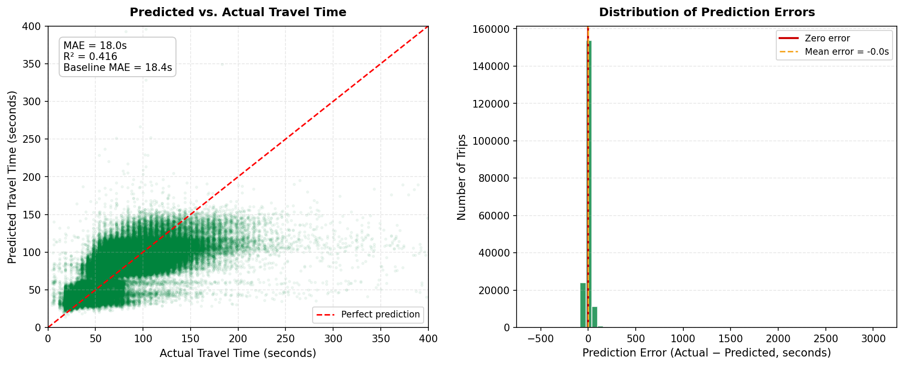

# The BU Commuter's Guide to the B-Branch: Predicting Transit Reliability

[INSERT YOUTUBE VIDEO LINK HERE]

## Project Description

Because the MBTA's Green Line B-Branch runs at street level through Boston University, it is uniquely susceptible to two types of disruptions:

1. **Weather** — Rain and snow that affect visibility and track friction, and subsequently how quickly a car can stop and start.

2. **BU Class Schedules** — BU "class transition windows" that spike boarding volumes at key stations as students hustle to and from classes.

This project builds a context-aware predictive model that treats a commute along the B-line as a sequence of **Running Time** (inter-station movement) and **Dwell Time** (platform boarding) segments rather than a single event. 

Two XGBoost regressors are trained separately on years of data from the MBTA for these two components, then combined into a trip calculator that accounts for how weather, class transition periods, and the BU Academic Calendar affect a student's specific commute.

**Why include the BU Academic Calendar?** The calendar tells the model when school is actually in session. For example, on a Saturday in the first week of January, there are no classes, so the model doesn't need to look for class transition surges that aren't happening. 

**Current model performance:**
- Dwell Time MAE: ~20 seconds
   - When the model predicts how long the train will sit at a stop while people board, it's off by about 20 seconds, on average.
- Running Time MAE: ~28 seconds
   - When the model predicts how long it takes to travel between two stops, it's off by about 28 seconds on average.

The project includes a Streamlit web app where users configure their trip, weather conditions, and BU class context to receive a segment-by-segment commute prediction.

---

## Repository Structure

```
.
├── requirements.txt              # Python dependencies
├── figures/
│   ├── fig1_hourly_class_vs_nonclass.png
│   ├── fig2_weather_impact.png
│   ├── fig3_data_processing.png
│   ├── fig4_stop_pair_times.png
│   ├── fig5_feature_importances.png
│   └── fig6_results.png
├── scripts/
│   ├── dataset_creation.py       # ETL pipeline — downloads raw MBTA data, merges weather, outputs Parquet
│   ├── dataset_example.py        # Utility — streams sample rows from Hugging Face for inspection
│   ├── data_visualization.py     # Generates exploratory figures saved to figures/
│   ├── model.py                  # Model training, backtesting, and prediction logic
│   ├── app.py                    # Streamlit web UI
│   └── model_artifacts/
│       ├── model.pkl             # Trained XGBoost model
│       ├── label_encoder.pkl     # Stop-pair label encoder
│       └── metadata.json         # Stop names, model metrics, feature importance
```

---

## Environment

- **Python:** 3.10 or later
- **OS:** macOS, Linux, or Windows (WSL recommended on Windows)
- **Hardware:** No GPU required; training runs on CPU in under a few minutes
- **Disk:** No large download required to run the app, model artifacts are included. Rebuilding the dataset from scratch (~500 MB) requires running dataset_creation.py separately.

---

## Setup

```bash
# 1. Clone the repository
git clone https://github.com/araujozBU/CS506-Final-Project.git
cd CS506-Final-Project

# 2. Install all dependencies
make install

# 3. Launch the web app
make run
```

Open the URL printed in your terminal (typically `http://localhost:8501`). Configure:

- **Route** — Start and end station (8 stations across Westbound/Eastbound)
- **Time** — Hour, day of week, month
- **Weather** — Temperature (°C), precipitation (mm), snow depth (mm)
- **BU Context** — Toggle on/off to reflect if it's a BU class day

The app displays a segment-by-segment breakdown showing predicted time versus the historical baseline for each **stop pair**.

- A "stop pair" is two consecutive stations — for example, "BU East → BU Central." The B-Line trip is broken into a series of these pairs, and the app predicts the travel time for each stop pair individually, rather than giving a single time prediction for the whole trip. 

- Why? Delays are not evenly distributed: a class transition surge might slow boarding at BU Central while the rest of the route is unaffected. Predicting each segment separately lets the model capture these localized effects instead of averaging them away.

### Inspect a Dataset Sample

```bash
python scripts/dataset_example.py
```

Streams 10 rows from the Hugging Face ML-ready dataset for quick inspection without a local download.

---

## Data Sources

| Source | Description |
|--------|-------------|
| [MBTA Rapid Transit Travel Times](https://mbta-massdot.opendata.arcgis.com/datasets/5f71a5c035fc4a4dad1b7fa73ba27ef8/) | Raw arrival/departure event data for the B-Branch (2024–2026), hosted on Hugging Face as `adybacki/24_25_26_mbta_lr_travel_times` |
| [Meteostat](https://meteostat.net/) | Hourly weather data for Boston Logan (station ID: `72503`) |
| BU Academic Calendar | Manually curated semester ranges, holidays, spring breaks, and class transition windows for 2024–2026 |
| ML-Ready Dataset | Processed and feature-engineered dataset on Hugging Face: `adybacki/bu_green_line_ml_ready` |

---

## Data Collection and Cleaning

**The Raw Data:** The MBTA travel time CSVs contain arrival and departure event records for every Green Line trip across all (B, C, D and E) branches. Each row represents a single station-to-station segment, but the full dataset includes all routes, all stop pairs, and many columns not relevant to this project.

**Filtering:** `dataset_creation.py` immediately filters to `route_id == 'Green-B'` and then does an inner join against the 12 adjacent stop pairs defined for the BU corridor, discarding everything else

**Handling missing/outlier values:**

- **Dwell time** is computed by subtracting a trip's previous segment arrival time from the current segment's departure time. 
   - For the first segment of any trip this can't be calculated, so those values are left as `NaN` and handled downstream during model training.
- **Dwell outliers**, any computed dwell time that is negative (artifacts) or ≥ 600 seconds (10 minutes, likely a service gap rather than normal boarding) are dropped.
- **Snow depth** — the Meteostat API omits the `snow` column entirely when there is no snow. These are filled with `0` after the weather merge.
- **Temperature and precipitation** — any hours with missing weather readings are filled using backward-fill then forward-fill, propagating the nearest valid hourly reading.
- **Floating point cleanup** — weather values are rounded after filling (`temp` to 1 decimal, `prcp` and `snow` to 2 decimals).

**What the script produces:** A Parquet file with one row per valid B-Branch segment event, joined with hourly weather and BU calendar flags (`is_bu_class_day`, `is_active_class_time`, `is_student_surge`), ready for model training.

---

## Feature Extraction

Features are built in `build_features()` in [`scripts/model.py`](scripts/model.py) and fall into four groups:

**Time features** — extracted directly from the departure timestamp:
- `hour`, `minute`, `day_of_week`, `month` — when the trip happened
- `is_weekend` — weekends have lighter, more predictable ridership than weekdays
- `is_peak_am` (7–9 AM), `is_peak_pm` (4–7 PM) — morning and evening rush hours

**Weather features** — hourly readings from Boston Logan Airport, joined by date and hour:
- `temp`, `prcp`, `snow` — temperature (°C), rainfall (mm), and snow depth (mm)
- `is_precipitating`, `is_snowing` — simple yes/no flags for whether it's currently raining or snowing
- `heavy_snow` — yes/no flag for snow depth over 5 mm, the threshold where service slowdowns become noticeable

**BU calendar flags** — engineered in `dataset_creation.py` from the manually curated academic calendar:
- `is_bu_class_day` — 1 if the date falls in a semester, is a weekday, and is not a holiday or spring break
- `is_active_class_time` — 1 if `is_bu_class_day` and the hour is between 8 AM–6 PM
- `is_student_surge` — 1 if the timestamp falls within a ~15-minute window after a BU class end time (MWF or TR schedule). A value of 2 flags the "triple-wave hotspot" (Tuesdays/Thursdays at 10:45 AM, when three overlapping class types all end simultaneously)

**Stop pair identifier** — `stop_pair_enc`, a label-encoded integer representing the specific station-to-station segment (e.g. "BU East → BU Central"). This lets the model learn a baseline for each segment without needing separate models per pair.

**What was tried and dropped:** Raw `trip_id` was available but not used. It is a unique identifier per trip and would cause the model to memorize individual trips rather than learn general patterns. Direction (Eastbound/Westbound) is implicitly captured by the stop pair encoding since each direction uses distinct stop IDs.

---

## Model

The project uses two **XGBoost regressors** — one for dwell time, one for running time — trained separately and then combined at prediction time.

**Why XGBoost?**

- **Handles mixed feature types well** — the dataset mixes continuous values (temperature, snow depth) with binary flags (is it a class day? is it rush hour?) and categorical identifiers (which stop pair). XGBoost handles this naturally without needing separate preprocessing pipelines for each type.

- **Captures non-linear relationships** — the effect of weather or class schedules on travel time varies. A light drizzle might add a few seconds; a blizzard adds minutes. Tree-based models learn these thresholds automatically rather than assuming a fixed linear relationship.

- **Prevents Overfitting** — transit times have a lot of natural variance (signal timing, traffic, operator behavior). XGBoost's gradient boosting approach and regularization parameters (`min_child_weight`, `reg_alpha`) help prevent the model from overfitting to that noise.

- **Training Speed** — the full dataset has hundreds of thousands of rows. XGBoost trains in under a few minutes on CPU, which made iteration during development practical.

**Why two separate models instead of one?** Dwell time and running time are driven by different factors. Dwell is heavily influenced by how many people are boarding (class surges, time of day), while running time is more sensitive to weather and signal conditions. Training them separately lets each model focus on its own signal without one target drowning out the other.

---

## Results

**Model performance** (evaluated on a held-out 20% test set):

| Metric | Dwell Time Model | Travel Time Model |
|--------|-----------------|-------------------|
| MAE | ~20 seconds | ~28 seconds |
| R² | — | 0.485 |
| Baseline MAE | — | ~18 seconds |

---

### Class Days vs. Non-Class Days



During BU class days (red), travel times are consistently 2–5 seconds higher per segment across the day, with the gap widening during morning, midday, and afternoon class transition windows. Non-class days (green) show a flatter, more predictable pattern throughout the day.

---

### Weather Impact



Across all weather conditions — clear, rain, snow, and heavy snow — the median travel time stays nearly flat at ~74 seconds per segment. Weather contributes less to travel time than class schedule context, and its effect shows up more in variance (wider error bars) than in the median. This is consistent with the feature importance chart below.

---

### Dataset Coverage



The dataset covers 26 months of B-Branch segment events (January 2024 – February 2026), with ~25,000–39,000 segments recorded per month. After cleaning, no missing values remain in the final training dataset.

---

### Segment Baselines



Travel times vary significantly by segment. The BU Central → Amory St stretch (108s) takes over three times as long as BU East → BU Central (30s), which is why segment-level prediction matters.

---

### Feature Importances



Stop pair identity dominates (0.800 importance score) — meaning which segment of track the train is on explains most of the variance in travel time. After that, the BU calendar flags (`is_active_class_time`, `is_bu_class_day`) and time-of-day features rank highest. Weather features (snowfall, precipitation, temperature) all score below 0.010, consistent with the weather impact chart above.

---

### Predicted vs. Actual Travel Time



The model tracks actual travel times closely for the 30–120 second range where most segments fall. The right panel shows prediction errors are tightly centered near zero, with a mean error of 3.7 seconds. The model struggles more with outliers — very long travel times caused by incidents, signal holds, or service gaps that don't appear consistently enough in the data to learn from.

---

**Limitations:**
- **Incident blindness** — the model has no awareness of MBTA service alerts, track work, or operator delays. These cause the largest real-world deviations and are the primary driver of high-error predictions.
- **Weather signal is weak** — weather affects the B-Line less than expected, likely because the MBTA already adjusts operations during severe conditions. The model reflects this but can't predict how operations will be adjusted.
- **Calendar gaps** — predictions outside the 2024–2026 training window (e.g., future semesters with different schedules) may be slightly less accurate until the model is retrained.

---

## Testing

The project includes a built-in **walk-forward backtesting** function in [`scripts/model.py`](scripts/model.py) that evaluates model generalization by training on earlier data and testing on later dates.

- Why? This won't allow the model to see future data in training, and mimics the way things would work in real life: analyzing past T transit times and evaluating on future data.

To run backtesting, uncomment the `backtest(df)` call at the bottom of `scripts/model.py` and re-run:

```bash
python scripts/model.py
```

This performs a 4-split temporal cross-validation using `GroupShuffleSplit` by stop pair, printing MAE and R² for each split.

- The dataset is divided into 4 time windows. The model trains on window 1, tests on window 2, then trains on windows 1–2, tests on window 3 — and so on. Each split produces a score, and then those scores are averaged to judge overall accuracy.

   - Why? This avoids overfitting.

- The splitting ensures that data from the same pair of stations (i.e., all "BU East → BU Central" rows) won't be split across train and test sets.

   - Why? This could otherwise inflate the model's appearance of accuracy.

- MAE (Mean Absolute Error) — how many seconds off the model's predictions are, on average.
   - It is directly interpretable: an MAE of 20 seconds means the prediction is wrong by about 20 seconds.

- R² (R-squared) — how much of the real-world variation in travel times the model explains, on a 0–1 scale (1 = perfect).
   - MAE alone doesn't tell if the model is actually capturing patterns or just guessing near the average every time. R² reveals whether the model responds meaningfully to changing conditions.

To verify the dataset pipeline, `dataset_example.py` streams a small sample from Hugging Face for manual inspection:

```bash
python scripts/dataset_example.py
```

---

## Contributing

1. **Fork** the repository and create a feature branch from `main`:
   ```bash
   git checkout -b feature/your-feature-name
   ```

2. **Make your changes.** Keep each branch focused on a single concern (data pipeline, model changes, UI, etc.).

3. **Test your changes** by running the backtesting function and verifying the Streamlit app loads without errors.

4. **Commit** with a clear message describing the *why* behind the change.

5. **Open a pull request** against `main`. Include:
   - A short description of what changed and why
   - Any impact on model metrics (MAE, R²) if model artifacts were retrained

**Reporting bugs or ideas:** Open an issue on the [GitHub repository](https://github.com/araujozBU/CS506-Final-Project/issues) with as much context as possible (OS, Python version, error message, steps to reproduce).

---

## Team

| Name | Email |
|------|-------|
| Zaki Araujo | araujoz@bu.edu |
| Adrian Dybacki | adybacki@bu.edu |
| Andrew Botolino | botolino@bu.edu |
| Kuba Rozwadowski | kubaroz@bu.edu |
| Rohan Chablani | rohan204@bu.edu |

**Repository:** [https://github.com/araujozBU/CS506-Final-Project](https://github.com/araujozBU/CS506-Final-Project)
